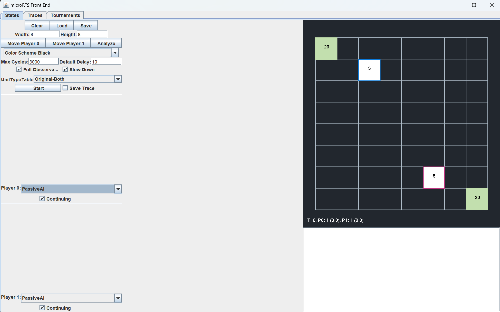

# FusionRTS Project

FusionRTS is a Java-based project aimed at developing an advanced AI for the microRTS game. This project extends the existing Monte Carlo Tree Search (MCTS) AI implementation by introducing three key enhancements: Progressive History, Tree Reuse, and a New Heuristic. These improvements aim to optimize decision-making and performance in microRTS gameplay.

---

## Table of Contents

- [About microRTS](#about-microrts)
- [Features](#features)
- [Requirements](#requirements)
- [Installation](#installation)
- [Usage](#usage)
- [Architecture](#architecture)
- [Contributing](#contributing)
- [Authors](#Authors)
- [Acknowledgments](#Acknowledgments)

---

## About microRTS

[microRTS](https://github.com/santiontanon/microrts) is a lightweight real-time strategy (RTS) game framework designed for AI research. It supports:
- A small action space compared to traditional RTS games like StarCraft II.
- Simplified mechanics for fast experimentation.
- A variety of maps and rulesets for AI benchmarking.

This project leverages the microRTS framework to develop a custom AI agent.

---

## Features

- **Progressive History:** A technique that incorporates historical performance data into the decision-making process, enabling the AI to prioritize actions that have performed well in similar contexts.
- **Tree Reuse:** This enhancement allows the AI to reuse parts of the search tree between consecutive turns, reducing redundant computations and improving efficiency.
- **New Heuristic:** A custom heuristic designed to evaluate game states more effectively, providing better guidance for the MCTS algorithm in large maps.

---

## Requirements

To build and run this project, you'll need:

- **Java Development Kit (JDK):** Version 8 or later.
- **microRTS Framework:** It is already included in this repository.
- **IDE:** Apache NetBeans IDE or any Java-compatible IDE.

---

## Installation

1. Clone this repository (it already install the base microRTS repository):
   ```bash
   git clone https://github.com/enri07/FusionRTSProject.git
   ```

2. Follow the instruction reported on [this page](https://sites.google.com/site/micrortsaicompetition/getting-started) from the step 1 to the step 3 to set up the base microRTS project. In this phase use as "src" folder the path `FusionRTSProject/microrts/src/`.

3. In your Java IDE, start by creating a new empty Java project named `FusionRTS`. Next, update the project properties by setting the source path to `FusionRTSProject/FusionRTS/src/`. Finally, configure the project's dependencies by linking it to the MicroRTS project created in step 2 through the `Libraries field`, and by adding all the JAR files located in `FusionRTSProject/microrts/lib/`.

4. To test wheter the configuration was successfully completed, add the `FusionRTSProject/FusionRTS/test/` folder inside the test path of `FusionRTS` project. Then, navigate to this folder and run the `GameVisualSimulationTest.java` file. If everything is correct, you should see the `FusionRTS` AI with all the enanchment activated facing a base `MCTS` AI on a 16x16 map.

---

## Test

We adapted the `FrontEnd.java` file available in microRTS to incorporate the newly created AIs. You can find and run it from the same test repository used for the `GameVisualSimulationTest.java` file. After you run the file, you should encounter the following interface:



0. **Configure Match information**
   - In the upper part of the interface you can configure several statistic about the match you want to create. For example, you can click the `load` button and you can enter a specific map available in the folder `FusionRTSProject/microrts/maps/`.

1. **Configure your AI**:
   - Then you have to select the Player0 and Player1 AIs. By scrolling the interative window, you can select any of the already available AIs in microRTS as well as the newly FusionRTS AIs available at the end.

2. **Configure FusionRTS AI with specific enanchments**:
   - To select the FusionRTS AI with a specific combination of enanchments we have provided several options.
   - The first possibility is to directly select from the list of AIs the ones incorporating some specific enanchments. E.g. `FusionRTSWithPH` is a `NaiveMCTS` already defined with Progressive History activated.
   - A second possibility is to select the general `FusionRTS` AI. This should open the interface shown in the Figure below. As you can see, at the bottom of it you can directly select the specific combination of enhancements you would like to test. 

   

3. **Run the game**:
   - Lastly, you can simply run the configurated game by clicking the `Start` button and see the AIs facing each other.

---

## Architecture

- **FusionRTS:** The core logic of the new AIs reside on the `FusionRTS` package.
- **MicroRTS:** Stores all the base files already availables in [microRTS](https://github.com/santiontanon/microrts).

---

## Contibuting

Contributions to FusionRTS are welcome! If you have ideas for further improvements or encounter issues, feel free to submit a pull request or open an issue in the repository.

---

## Authors

### Current Lead Authors

- **DeJava Team**
  - Enrico Calandrini
  - Carmine Vitiello
  - Davide Mele

---

## Acknowledgments

- [microRTS](https://github.com/santiontanon/microrts) for providing the base framework.
- The research community for inspiration behind Progressive History, Tree Reuse, and heuristic optimization techniques.

